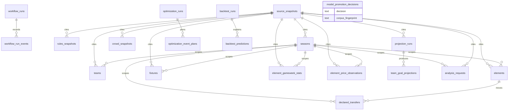

# Schema reference

Audit item #192. Sixteen migrations define twenty tables, and reading them in
order is the only way to see the model. This is that view.

The organising rule, which is not obvious from any single migration:

> **Evidence, model artifacts and crowd movement are immutable. Upstream mirror
> data and job state are not.**

Ten tables carry a trigger that rejects `update` and `delete`. Seven do not, and
the exception is deliberate: FPL revises in-season data after a gameweek closes,
so the history corpus has to be re-writable. Provenance survives because every
corpus row records the immutable `source_snapshots` row it came from.

Every table has `enable row level security` **and** `force row level security`,
and there are no policies. See `docs/adr/0001-forced-rls-with-no-policies.md`.

## The shape of it

Audit item #107. The arrows are the foreign keys; everything else is prose
below.

Three shapes to notice. `source_snapshots` is the hub: nine tables cite it, and
that is what makes the mutable corpus auditable despite being mutable. The three
`_runs` tables each own a detail table that cascades on delete, so a run and its
output cannot become separated. And `model_promotion_decisions` stands alone,
because a promotion is a judgement about two models rather than a row derived
from evidence.

## Naming

Audit item #108. These are descriptive rather than aspirational — every
migration in the tree already follows them, and a test enforces it.

| Object     | Pattern                      | Example                                         |
| ---------- | ---------------------------- | ----------------------------------------------- |
| Table      | plural snake_case            | `element_gameweek_stats`                        |
| Index      | `<table>_<columns>_idx`      | `backtest_runs_season_method_idx`               |
| Constraint | `<table>_<claim being made>` | `crowd_snapshots_captaincy_needs_a_denominator` |
| Trigger    | `<table>_<verb phrase>`      | `source_snapshots_are_immutable`                |
| Function   | `private.<verb>_<noun>`      | `private.reject_immutable_snapshot_mutation`    |

Constraint names are read in error messages by whoever is holding the failing
insert, so they are written as the claim they enforce rather than as a code.
`crowd_snapshots_captaincy_needs_a_denominator` says what to fix;
`crowd_snapshots_check_3` would not.

Helper functions live in `private` rather than `public` because nothing outside
the schema should call them, and `public` is the schema PostgREST exposes.

---

## Job state

### `workflow_runs`

One row per job execution. The only table whose rows change status in place,
because a run that started and then finished is one run, not two.

- **Grain**: one workflow execution
- **Mutable**: yes — status transitions
- **Referenced by**: `projection_runs`, `model_promotion_decisions`,
  `optimization_runs`, `workflow_run_events`
- **Notable**: `event_id` bounded 1..47, matching the longest season FPL has run

### `workflow_run_events`

Every status transition, appended. `workflow_runs` is the current state; this is
what happened to get there.

The row above is overwritten as a run proceeds, so by the time anyone looks it
says `failed` and when it began, and everything between is gone: whether it ran
once or was retried, how long it spent running, whether an earlier attempt had
already succeeded. That is the shape of question asked during an incident and it
was unanswerable.

Written by a trigger rather than by the application. The Python recorder is a
context manager, and a process killed between the status update and a separate
insert would move the state without recording it. In the trigger they are the
same transaction by construction, and a second writer — a manual correction in
the SQL editor, a future job in another language — is recorded whether or not it
knows the table exists.

- **Grain**: one status transition
- **Mutable**: no — immutable by trigger
- **References**: `workflow_runs` (`on delete cascade`)
- **Notable**: `from_status` is null on the first event only; a transition to
  the same status is refused, so a retry loop cannot become an unbounded write.
  `failure_reason` is only permitted on a terminal status, and is a copy that
  survives the run row being overwritten by a later attempt.

---

## Evidence

### `source_snapshots`

Every byte this project has ingested, hashed. Nothing else in the schema is
allowed to claim a provenance that is not a row here.

- **Grain**: one fetched payload
- **Immutable**: yes — `reject_immutable_snapshot_mutation`
- **Referenced by**: `rules_snapshots`, `teams`, `elements`, `fixtures`,
  `element_gameweek_stats`, `element_price_observations`, `crowd_snapshots`

### `rules_snapshots`

FPL's published rules as they stood at a moment. The table that makes "never
default a missing controlling FPL rule" enforceable: the rule came from here or
it did not come from anywhere.

- **Grain**: one published rules payload per season
- **Immutable**: yes
- **References**: `source_snapshots`

---

## Model artifacts

All immutable via `reject_immutable_model_artifact_mutation`. Superseding one
means inserting a new row; the old one stays for audit.

### `projection_runs`

- **Grain**: one projection job
- **References**: `workflow_runs`

### `team_goal_projections`

- **Grain**: one team, one fixture, one run
- **References**: `projection_runs`

### `model_promotion_decisions`

Whether a candidate model replaced its baseline, and the evidence.

- **Grain**: one baseline-versus-candidate comparison
- **References**: `workflow_runs`
- **Notable**: carries `code_revision`, `corpus_fingerprint`,
  `dependency_fingerprint` and `seed_replicates` so the decision is
  reproducible — see `docs/adr` and audit item #197. A row that promoted on
  fewer seeds than it replicated is refused by check constraint.

### `optimization_runs`

- **Grain**: one solver invocation
- **References**: `workflow_runs`
- **Notable**: `unique_sha256_array` enforces that every cited hash is a real
  sha256 and that none repeats

### `optimization_event_plans`

- **Grain**: one gameweek within one optimisation run
- **References**: `optimization_runs`
- **Notable**: the heaviest constraint set in the schema. Squad, starters, bench
  and transfer arrays are checked to be positive and unique
  (`positive_unique_bigint_array`), starters and bench disjoint
  (`bigint_arrays_are_disjoint`), and starters a subset of the squad
  (`bigint_array_is_subset`). An illegal plan cannot be stored.

### `backtest_runs`

- **Grain**: one method scored over one season
- **References**: `seasons`
- **Unique**: `(season, method, code_revision, first_scored_gameweek)` — two runs
  of the same season from different code are different experiments
- **Notable**: `corpus_fingerprint` names the data the metric was measured over

### `backtest_predictions`

- **Grain**: one player, one gameweek, one run
- **References**: `backtest_runs` **on delete cascade** — the only cascade in the
  schema. Predictions have no meaning without the run that made them.

### `crowd_snapshots`

What the field owned at a moment. Immutable because a crowd position is a fact
about a time, not a current value.

- **Grain**: one player, one capture
- **References**: `elements`, `seasons`, `source_snapshots`

---

## History corpus

**Deliberately mutable.** FPL revises in-season data after a gameweek closes —
bonus points settle, a goal is reassigned — and a corpus that refused to accept
the correction would be permanently wrong. Every row cites the
`source_snapshots` it came from, so mutability does not cost provenance.

| Table                        | Grain                        |
| ---------------------------- | ---------------------------- |
| `seasons`                    | one season                   |
| `teams`                      | one club in one season       |
| `elements`                   | one player in one season     |
| `fixtures`                   | one match                    |
| `element_gameweek_stats`     | one player in one fixture    |
| `element_price_observations` | one player price at one time |

`element_gameweek_stats` is the largest table and the one every model reads. Its
grain is **per fixture, not per gameweek**: a double gameweek gives a player two
rows, and the `20260801140000` migration exists because the original per-gameweek
key silently discarded one of them.

Season identity is reassigned by FPL every year — `element_id` and `team_id` both
change — so `code` is carried alongside as the stable identity. Anything joining
across seasons must use the code.

Growth is measured and deliberately unpartitioned: see
`docs/adr/0005-no-partitioning-for-the-history-corpus.md`.

---

## Manager-supplied state

What a manager tells us that FPL has not published. Both tables hold private
team state, so both are forced-RLS with no policy: `service_role` only, and the
browser key cannot reach them.

### `analysis_requests`

One row per plan generated for a manager, so a rate limit and a "you last looked
at this on ..." line have something to read, and a bug report can be tied to the
inputs that produced it.

- **Grain**: one request
- **References**: `seasons`, `source_snapshots`
- The `event` recorded is the gameweek planned **from**, which differs from the
  gameweek the request was made in either side of a deadline.

### `declared_transfers`

A manager's picks are private until the deadline passes, so between a transfer
and the deadline the public API still shows the old squad — and planning from it
recommends a transfer already made. The manager tells us instead.

- **Grain**: one swap, one gameweek
- **References**: `seasons`, `elements` twice — out and in
- Stored as a pair, because a half-entered swap would reach the planner as a
  fourteen-player squad.
- `superseded_at` is set once the public API catches up, so the override is not
  applied twice.

---

## The `private` schema

Six functions, none reachable by `anon` or `authenticated`.

| Function                                         | Purpose                                                                              |
| ------------------------------------------------ | ------------------------------------------------------------------------------------ |
| `reject_immutable_snapshot_mutation()`           | Trigger. Rejects update/delete on evidence tables, hinting to insert a new snapshot. |
| `reject_immutable_model_artifact_mutation()`     | Trigger. Same, for artifacts, hinting to publish a new one.                          |
| `positive_unique_bigint_array(bigint[])`         | Every element positive and distinct.                                                 |
| `unique_sha256_array(text[])`                    | Every element a real sha256, none repeated.                                          |
| `bigint_array_is_subset(bigint[], bigint[])`     | Containment, for starters within a squad.                                            |
| `bigint_arrays_are_disjoint(bigint[], bigint[])` | Non-overlap, for starters versus bench.                                              |

The array helpers are what make an illegal squad unstorable rather than merely
unlikely. They live in `private` so a client cannot call them to probe the shape
of the data.

---

## Teardown order

`supabase/rollback/down.sql` drops everything in reverse dependency order. Only
`backtest_predictions` cascades; every other foreign key is `no action`, so a
referrer must go before its target.

`python/tests/test_rollback_harness.py` derives the real foreign keys from the
migrations and fails if the script's order would violate one, so this cannot rot
into a script that fails halfway through the incident it exists to resolve.
